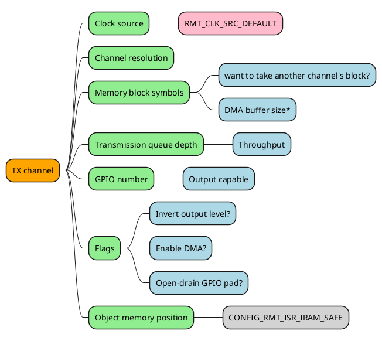
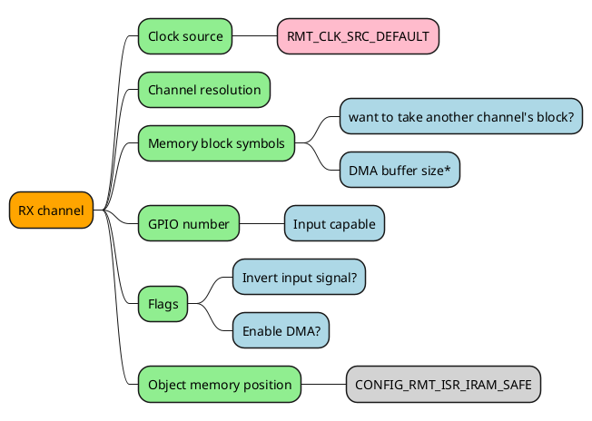
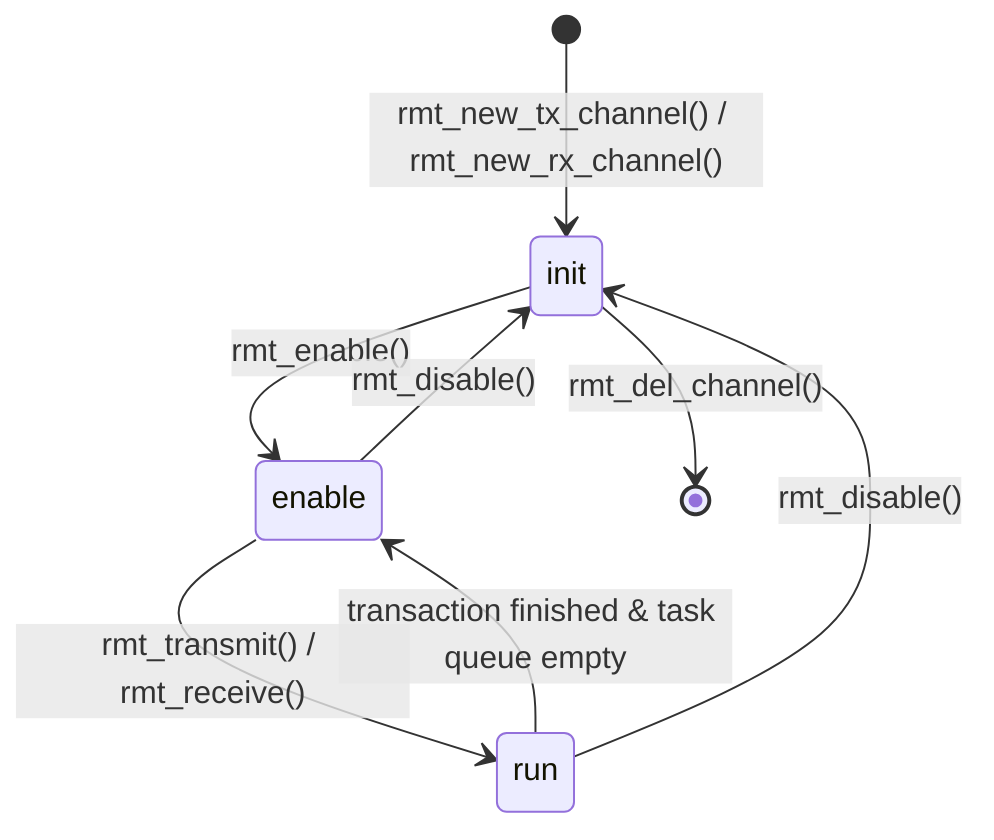
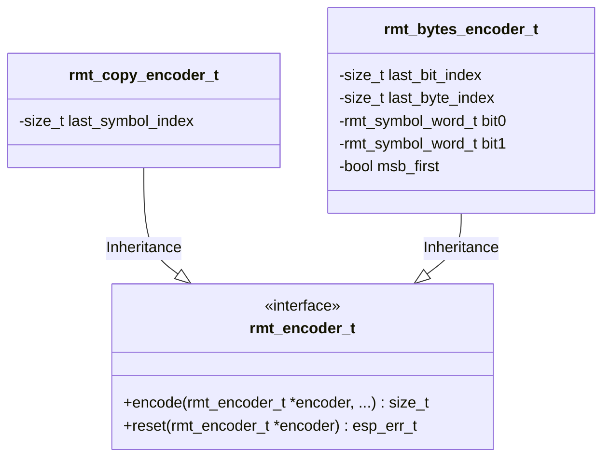
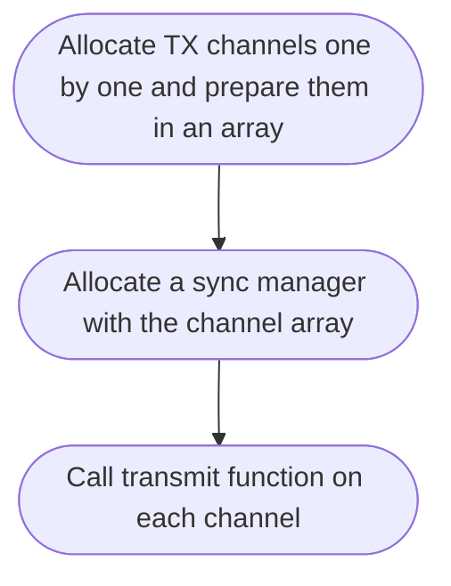

# Play Fun with RMT Peripheral

Dive into the RMT peripheral driver in ESP-IDF

<div class="uppercase text-sm tracking-widest">
Mao Shengrong (suda-morris)
</div>

<div class="pt-10">
  <span @click="$slidev.nav.next" class="px-2 py-1 rounded cursor-pointer" hover="bg-white bg-opacity-10">
    Let's Start! <carbon:arrow-right class="mx-2 inline animate-ping"/>
  </span>
</div>

<!--
Hey, Welcome to my talk.
Today, we're going to learn a famous Espressif peripheral, called RMT.
During this talk, I hope you guys will be inspired by it and can use it with more confidence in your projects.
So, let's start!
-->

---

# Overview <Logo/>

RMT was designed for Sending and Receiving *IR Remote* signals, but later it turns out to be a versatile peripheral that can act like a general purpose transceiver.

- <twemoji-open-book/> **Quick HW background** - RMT symbol definition, features introduction
- <twemoji-man-technologist/> **Get started with TX channel** - General steps to acquire a TX channel and transmit data
- <twemoji-woman-technologist/> **Get started with RX channel** - General steps to acquire a RX channel and receive data
- <twemoji-woman-juggling/> **Dive into RMT encoder** - How to customize your own RMT encoder
- <twemoji-confetti-ball/> **Awesome RMT** - What beautiful examples we have of RMT
- <twemoji-grinning-face/> **Wellknown limitations** - Things that RMT can't do very well and ways to mitigate
- <twemoji-man-raising-hand/> **Q&A** - Common questions? Feature requests? Driver bugs? ...

<div class="pt-5 flex justify-between">

<span class="inline cursor-pointer pt-15" @click="$slidev.nav.next">
<uim-rocket/>
<uim-rocket class="text-3xl text-red-400 mx-2" />
<uim-rocket class="text-4xl text-orange-400 mx-2 animate-pulse"/>
</span>
</div>

<style>
h1 {
  background-color: #2B90B6;
  background-image: linear-gradient(45deg, #4EC5D4 10%, #146b8c 20%);
  background-size: 100%;
  -webkit-background-clip: text;
  -moz-background-clip: text;
  -webkit-text-fill-color: transparent;
  -moz-text-fill-color: transparent;
}
li {
  @apply mt-1;
}
</style>

<!--
Please scan the QR code on the page if you want to read the slides on your phone.
In this talk, we will start with a quick overview of RMT IP design.
Then we will dive into the driver and learn how to use it.
I will show you some awesome examples of RMT.
Finally, we will talk about some limitations of RMT and how to mitigate them.
-->

---

# RMT Architecture [^1] <Logo/>


<div class="grid grid-cols-2">

<v-click>

> Each channel has slightly different ability.

</v-click>

<v-click>

> Only the last channel has **DMA** support.

</v-click>
<v-click>

> All channels share the same **clock** and **interrupt**.

</v-click>
<v-click>

> One shared block memory. Each channel can take multiple blocks.

</v-click>
</div>


[^1]: [ESP32-S3 TRM](https://www.espressif.com/sites/default/files/documentation/esp32-s3_technical_reference_manual_en.pdf#rmt)

<style>
.footnotes-sep {
  @apply opacity-10;
}
.footnotes {
  @apply text-xs opacity-75;
}
.footnote-backref {
  display: none;
}
</style>

<!--
RMT TX channels and RX channels are almost independent.
The RX filter is clocked differently from the edge detector.
-->

---

# TX Channel Allocation <MarkerAPI /> <Logo/>

The RMT channels have so many constraints and traps, it's risky to let the user specify the channel directly.

The driver uses a *factory pattern* to help manage all the channel resources and dependencies.

<div class="grid grid-cols-2 gap-1 items-center">

```c {all|2-13|14|15-16|all}
rmt_channel_handle_t tx_channel = NULL;
rmt_tx_channel_config_t tx_channel_cfg = {
  .clk_src = RMT_CLK_SRC_DEFAULT,
  .resolution_hz = EXAMPLE_RESOLUTION_HZ,
  .mem_block_symbols = 64,
  .trans_queue_depth = 4,
  .gpio_num = EXAMPLE_IR_TX_GPIO_NUM,
  .flags = {
    .invert_out = false,
    .with_dma = false,
    .io_od_mode = false,
  },
};
rmt_new_tx_channel(&tx_channel_cfg, &tx_channel);
// if CONFIG_RMT_ISR_IRAM_SAFE is enabled,
// the channel object is allocated on SRAM for sure.
```



</div>

<!--
The channel object could be allocated on SRAM or PSRAM, depending on Kconfig and driver configurations.

FAQ: why can I only get 2 channels but the TRM says it has 4 channels?
A: Many aspects can affect the channel search algorithm. e.g. The driver won't return a channel whose memory block is taken by another one.

The key point is how to set the mem_block_symbols, depending on application requirements. It decides the maximum number of symbols that can be saved by the channel without interrupting the CPU. It means differently when DMA is enabled or not.
-->

---

# RX Channel Allocation <MarkerAPI /> <Logo/>

The configuration of the RX channel and the TX channel is almost symmetrical.

If the TX channels have taken all the memory blocks, the RX channel will fail to allocate, vice versa.

<div class="grid grid-cols-2 gap-1 items-center">

```c {all|2-11|12|all}
rmt_channel_handle_t rx_channel = NULL;
rmt_rx_channel_config_t rx_channel_cfg = {
  .clk_src = RMT_CLK_SRC_DEFAULT,
  .resolution_hz = EXAMPLE_RESOLUTION_HZ,
  .mem_block_symbols = 64,
  .gpio_num = EXAMPLE_IR_RX_GPIO_NUM,
  .flags = {
    .invert_in = false,
    .with_dma = false,
  },
};
rmt_new_rx_channel(&rx_channel_cfg, &rx_channel);
```



</div>

<v-click>
<Arrow x1="80" y1="280" x2="50" y2="450" color="#03DAC6"/>
<div>

| ESP32 & ESP32-S2| Others | DMA |
| --------------- | ------ | --- |
| Ping-Pong mode <twemoji-cross-mark-button/> <br/> It determines the maximum RMT symbols in one transaction. | Ping-Pong mode <twemoji-check-mark-button/> <br/> It sets the memory blocks it will take implicitly | DMA buffer size |


</div>
</v-click>

<!--
The aspects to take into consideration before creating an RX channel are the same as the TX channel.
The RX channel can't use a different clock source from the TX channel.
-->

---

# Carrier <MarkerAPI /> <Logo/>


<div class="grid grid-cols-2 gap-4">

<v-clicks :every='2'>

- Carrier is applied to the **high** level of the base signal, unless `polarity_active_low` is true
- Carrier shows up only when there's data transfer on the line, unless `always_on` is true

```c
rmt_carrier_config_t carrier_cfg = {
  .frequency_hz = 38000,
  .duty_cycle = 0.33,
  .flags = {
    .polarity_active_low = false,
    .always_on = false,
  },
};
rmt_apply_carrier(tx_channel, &carrier_cfg);
```

- Carrier frequency set for the RX channel should be slightly **smaller** than the theoretical value so that the receiver can detect the carrier signal correctly

```c
rmt_carrier_config_t carrier_cfg = {
  .frequency_hz = 25000,
  .duty_cycle = 0.33,
};
rmt_apply_carrier(rx_channel, &carrier_cfg);
```

</v-clicks>

</div>

<!--
For the RX channel, we can't set the carrier frequency exactly to the theoretical value.
It’s recommended to leave a tolerance for the carrier frequency.
The reason is that reflection and refraction will occur when a signal travels through the air, leading to distortion on the receiver side.
-->

---

# State Transition <Marker class="text-red-500">Internal</Marker> <Logo/>

<div class="grid grid-cols-2 gap-4">



<v-clicks class="my-auto">

- `rmt_enable` / `rmt_disable` will *acquire* / *release* the power management lock
- When the RMT TX channel is running in an infinite hardware loop, the only way to stop it is `rmt_disable`
- `rmt_enable` can pick a pending transaction from queue and start it

</v-clicks>
</div>

```c
esp_err_t rmt_enable(rmt_channel_handle_t channel);
esp_err_t rmt_disable(rmt_channel_handle_t channel);
```

<!--
rmt_enable and rmt_disable are symmetrical.
-->

---

# Transmit & Receive <MarkerAPI /> <Logo/>


<div class="grid grid-cols-2 gap-4">

### TX channel <Marker class="text-red-500">Non-blocking</Marker>
### RX channel <Marker class="text-red-500">Non-blocking</Marker>

<v-clicks :every='2'>

```c
rmt_transmit_config_t transmit_config = {
  .loop_count = 0,
  .flags.eot_level = 0,
};
rmt_transmit(led_chan, led_encoder,
             led_strip_pixels, sizeof(led_strip_pixels),
             &transmit_config);
```

```c
rmt_receive_config_t receive_config = {
  .signal_range_min_ns = 1250,
  .signal_range_max_ns = 12000000,
};
rmt_symbol_word_t raw_symbols[64];
rmt_receive(rx_channel, raw_symbols, sizeof(raw_symbols),
            &receive_config);
```

</v-clicks>

<div>
<v-clicks>

- `eot_level` controls the output level after the last symbol is sent
- `led_encoder` is a user customized encoder

<br/>

| `loop_count` | -1 | 0 | N > 0|
| ------------ | -- | - | ---- |
| Description | Infinite loop | Single shot | N times |

</v-clicks>
</div>

<div>
<v-clicks>

- pulse with duration shorter than `signal_range_min_ns` is  **noise**
- pulse with duration longer than `signal_range_max_ns` is **STOP signal**
- truncated the received symbols if the user provided buffer is not big enough

</v-clicks>
</div>
</div>

<!--
both transmit and receive functions are not blocking functions.
Transmit: construct a transaction and push it to a queue
Receive: set up the stop timing, DMA then start the engine
-->

---

# Event Callback <MarkerAPI /> <Logo/>

<div class="grid grid-cols-2 gap-4">

#### TX channel
#### RX channel

<v-clicks :every='2'>

```c
static bool example_rmt_tx_done_callback(rmt_channel_handle_t channel, const rmt_tx_done_event_data_t *edata, void *user_data)
{
  uint32_t *user = (uint32_t *)user_data;
  esp_rom_printf("Transmitted %d symbols\n", edata->num_symbols);
  return false;
}
rmt_tx_event_callbacks_t cbs = {
  .on_trans_done = example_rmt_tx_done_callback,
};
uint32_t user_data = 0;
rmt_tx_register_event_callbacks(tx_channel, &cbs, &user_data);
```

```c
static bool example_rmt_rx_done_callback(rmt_channel_handle_t channel, const rmt_rx_done_event_data_t *edata, void *user_data)
{
  BaseType_t high_task_wakeup = pdFALSE;
  QueueHandle_t receive_queue = (QueueHandle_t)user_data;
  xQueueSendFromISR(receive_queue, edata, &high_task_wakeup);
  return high_task_wakeup == pdTRUE;
}
QueueHandle_t receive_queue = xQueueCreate(1, sizeof(rmt_rx_done_event_data_t));
rmt_rx_event_callbacks_t cbs = {
  .on_recv_done = example_rmt_rx_done_callback,
};
rmt_rx_register_event_callbacks(rx_channel, &cbs, receive_queue);
```

</v-clicks>
</div>

<v-clicks>

- <carbon-checkmark-filled-warning class="text-red-500"/> Callback function is running under the <span class="text-red-300">*ISR*</span> context
- <carbon-status-change class="text-green-500" /> Callback function returns `true` to indicate a need of context switch
- if `CONFIG_RMT_ISR_IRAM_SAFE` enabled
  - <carbon-thumbs-up-filled class="text-yellow-500"/> Interrupt event won't be differed along with flash operations
  - <carbon-thumbs-down-filled class="text-yellow-500"/> Callback function should not access the flash memory

</v-clicks>

<!--
The callback function can't call any blocking APIs.
-->

---

# Native Encoder <MarkerAPI /> <Logo/>

RMT encoder is <span class="text-fuchsia-300">composable <carbon-badge /></span>, you can combine any native encoders into a new encoder.

<div class="grid grid-cols-2 gap-2">



<div>
<v-clicks>

```c
rmt_encoder_handle_t encoder = NULL;
rmt_copy_encoder_config_t copy_encoder_config = {};
rmt_new_copy_encoder(&copy_encoder_config, &encoder);
```

```c
rmt_encoder_handle_t encoder = NULL;
rmt_bytes_encoder_config_t bytes_encoder_config = {
  .bit0 = {
    .level0 = 1,
    .duration0 = 3,
    .level1 = 0,
    .duration1 = 9,
  },
  .bit1 = {
    .level0 = 1,
    .duration0 = 9,
    .level1 = 0,
    .duration1 = 3,
  },
  .flags.msb_first = 1,
};
rmt_new_bytes_encoder(&bytes_encoder_config, &encoder);
```

</v-clicks>
</div>
</div>

<!--
The driver publics the RMT encoder interface.
User can customize their own encoders by inheriting the interface.
-->

---
layout: image-right
image: /ir-remote.jpg
---

# NEC Encoder <MarkerExample />


```c {all|2|3-4|5-6|9-20|7|1-8|all}
typedef struct {
  rmt_encoder_t base;
  rmt_encoder_t *copy_encoder;
  rmt_encoder_t *bytes_encoder;
  rmt_symbol_word_t nec_leading_symbol;
  rmt_symbol_word_t nec_ending_symbol;
  int state;
} rmt_ir_nec_encoder_t;
nec_leading_symbol = (rmt_symbol_word_t) {
    .level0 = 1,
    .duration0 = 9000ULL * rmt_chan_res / 1000000,
    .level1 = 0,
    .duration1 = 4500ULL * rmt_chan_res / 1000000,
};
nec_ending_symbol = (rmt_symbol_word_t) {
    .level0 = 1,
    .duration0 = 560 * rmt_chan_res / 1000000,
    .level1 = 0,
    .duration1 = 0x7FFF,
};
```

<!--
Use the copy_encoder to encode the leading and ending pulse
Use the bytes_encoder to encode the address and command data
state records the current encoding step
-->

---

# NEC Encoder <Marker class="text-orange-500"><a href="https://github.com/espressif/esp-idf/tree/master/examples/peripherals/rmt/ir_nec_transceiver" target="_blank">Example</a></Marker>

<div class="grid grid-cols-2 gap-2 items-center">


</div>

```c
typedef struct {
    uint16_t address;
    uint16_t command;
} ir_nec_scan_code_t;
```

```c {1-3|5|13-23|24-34|35-45|46-56|58-60|all}
static size_t rmt_encode_ir_nec(rmt_encoder_t *encoder, rmt_channel_handle_t channel,
                                const void *primary_data, size_t data_size,
                                rmt_encode_state_t *ret_state)
{
    rmt_ir_nec_encoder_t *nec_encoder = __containerof(encoder, rmt_ir_nec_encoder_t, base);
    rmt_encode_state_t session_state = RMT_ENCODING_RESET;
    rmt_encode_state_t state = RMT_ENCODING_RESET;
    size_t encoded_symbols = 0;
    ir_nec_scan_code_t *scan_code = (ir_nec_scan_code_t *)primary_data;
    rmt_encoder_handle_t copy_encoder = nec_encoder->copy_encoder;
    rmt_encoder_handle_t bytes_encoder = nec_encoder->bytes_encoder;
    switch (nec_encoder->state) {
    case 0: // send leading code
        encoded_symbols += copy_encoder->encode(copy_encoder, channel, &nec_encoder->nec_leading_symbol,
                                                sizeof(rmt_symbol_word_t), &session_state);
        if (session_state & RMT_ENCODING_COMPLETE) {
            nec_encoder->state = 1; // we can only switch to next state when current encoder finished
        }
        if (session_state & RMT_ENCODING_MEM_FULL) {
            state |= RMT_ENCODING_MEM_FULL;
            goto out; // yield if there's no free space to put other encoding artifacts
        }
    // fall-through
    case 1: // send address
        encoded_symbols += bytes_encoder->encode(bytes_encoder, channel, &scan_code->address,
                                                 sizeof(uint16_t), &session_state);
        if (session_state & RMT_ENCODING_COMPLETE) {
            nec_encoder->state = 2; // we can only switch to next state when current encoder finished
        }
        if (session_state & RMT_ENCODING_MEM_FULL) {
            state |= RMT_ENCODING_MEM_FULL;
            goto out; // yield if there's no free space to put other encoding artifacts
        }
    // fall-through
    case 2: // send command
        encoded_symbols += bytes_encoder->encode(bytes_encoder, channel, &scan_code->command,
                                                 sizeof(uint16_t), &session_state);
        if (session_state & RMT_ENCODING_COMPLETE) {
            nec_encoder->state = 3; // we can only switch to next state when current encoder finished
        }
        if (session_state & RMT_ENCODING_MEM_FULL) {
            state |= RMT_ENCODING_MEM_FULL;
            goto out; // yield if there's no free space to put other encoding artifacts
        }
    // fall-through
    case 3: // send ending code
        encoded_symbols += copy_encoder->encode(copy_encoder, channel, &nec_encoder->nec_ending_symbol,
                                                sizeof(rmt_symbol_word_t), &session_state);
        if (session_state & RMT_ENCODING_COMPLETE) {
            nec_encoder->state = RMT_ENCODING_RESET; // back to the initial encoding session
            state |= RMT_ENCODING_COMPLETE; // telling the caller the NEC encoding has finished
        }
        if (session_state & RMT_ENCODING_MEM_FULL) {
            state |= RMT_ENCODING_MEM_FULL;
            goto out; // yield if there's no free space to put other encoding artifacts
        }
    }
out:
    *ret_state = state;
    return encoded_symbols;
}
```

<style>
.slidev-layout pre, .slidev-layout code {
    max-height: 230px;
}
</style>


---
layout: image-right
image: /led-strip.jpg
---

# LED Strip <Marker class="text-orange-500"><a href="https://github.com/espressif/esp-idf/tree/master/examples/peripherals/rmt/led_strip" target="_blank">Example</a></Marker>

[](https://components.espressif.com/components/espressif/led_strip)


```c
static size_t rmt_encode_led_strip(rmt_encoder_t *encoder, rmt_channel_handle_t channel,
                                   const void *primary_data, size_t data_size,
                                   rmt_encode_state_t *ret_state)
{
    rmt_led_strip_encoder_t *led_encoder = __containerof(encoder, rmt_led_strip_encoder_t, base);
    rmt_encoder_handle_t bytes_encoder = led_encoder->bytes_encoder;
    rmt_encoder_handle_t copy_encoder = led_encoder->copy_encoder;
    rmt_encode_state_t session_state = RMT_ENCODING_RESET;
    rmt_encode_state_t state = RMT_ENCODING_RESET;
    size_t encoded_symbols = 0;
    switch (led_encoder->state) {
    case 0: // send RGB data
        encoded_symbols += bytes_encoder->encode(bytes_encoder, channel, primary_data, data_size, &session_state);
        if (session_state & RMT_ENCODING_COMPLETE) {
            led_encoder->state = 1; // switch to next state when current encoding session finished
        }
        if (session_state & RMT_ENCODING_MEM_FULL) {
            state |= RMT_ENCODING_MEM_FULL;
            goto out; // yield if there's no free space for encoding artifacts
        }
    // fall-through
    case 1: // send reset code
        encoded_symbols += copy_encoder->encode(copy_encoder, channel, &led_encoder->reset_code,
                                                sizeof(led_encoder->reset_code), &session_state);
        if (session_state & RMT_ENCODING_COMPLETE) {
            led_encoder->state = RMT_ENCODING_RESET; // back to the initial encoding session
            state |= RMT_ENCODING_COMPLETE;
        }
        if (session_state & RMT_ENCODING_MEM_FULL) {
            state |= RMT_ENCODING_MEM_FULL;
            goto out; // yield if there's no free space for encoding artifacts
        }
    }
out:
    *ret_state = state;
    return encoded_symbols;
}
```

<style>
.slidev-layout pre, .slidev-layout code {
    max-height: 330px;
}
</style>

<!--
We have a library for the led_strip driver.
-->

---
layout: image-right
image: /tx-simultaneously.jpg
---

# TX Sync <MarkerAPI />

```c {all|1|3-7|8-10|all}
rmt_channel_handle_t tx_channels[TEST_RMT_CHANS];
rmt_sync_manager_handle_t synchro = NULL;
rmt_sync_manager_config_t synchro_config = {
  .tx_channel_array = tx_channels,
  .array_size = TEST_RMT_CHANS,
};
rmt_new_sync_manager(&synchro_config, &synchro);
for (int i = 0; i < TEST_RMT_CHANS; i++) {
  rmt_transmit(tx_channels[i], led_strip_encoders[i], leds_grb, TEST_LED_NUM * 3, &transmit_config);
}
```



> The transmissions won't start until the last managed channel starts the transmission successfully.

<!--
It's hard to call the transmit function on different cores.
It's impossible to do it on a single-core CPU.
-->

---

# Other Examples <MarkerExample />

| Example | Descriptions | Key RMT features used |
| --- | --- | --- |
|  | [D-Shot protocol Electronic Speed Controller](https://github.com/espressif/esp-idf/tree/master/examples/peripherals/rmt/dshot_esc) | Infinite RMT transmission loop |
|   | [Stepper Motor Smooth Controller](https://github.com/espressif/esp-idf/tree/master/examples/peripherals/rmt/stepper_motor) | Precise number of RMT transmission loop |
|   | [1-Wire Sensor: DS18B20](https://github.com/espressif/esp-idf/tree/master/examples/peripherals/rmt/onewire) | Bind TX and RX channel to the same GPIO |


---
layout: iframe-right
url: >-
  https://docs.espressif.com/projects/esp-idf/en/latest/esp32/api-reference/peripherals/rmt.html
class: text-left
---

# Learn More <carbon-machine-learning-model/>

* [Examples](https://github.com/espressif/esp-idf/tree/master/examples/peripherals)
* [TRM](https://www.espressif.com/sites/default/files/documentation/esp32-s3_technical_reference_manual_en.pdf#rmt)
* [Programming Guide](https://docs.espressif.com/projects/esp-idf/en/latest/esp32/api-reference/peripherals/rmt.html)

---
layout: center
class: text-center pb-5
---

# Thank You! <twemoji-crab class="animate-bounce"/>

Slides source code can be found on [Github](https://github.com/suda-morris/rmt-driver-lecture)
